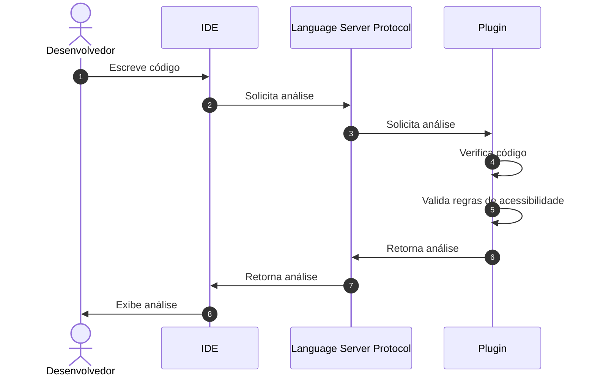
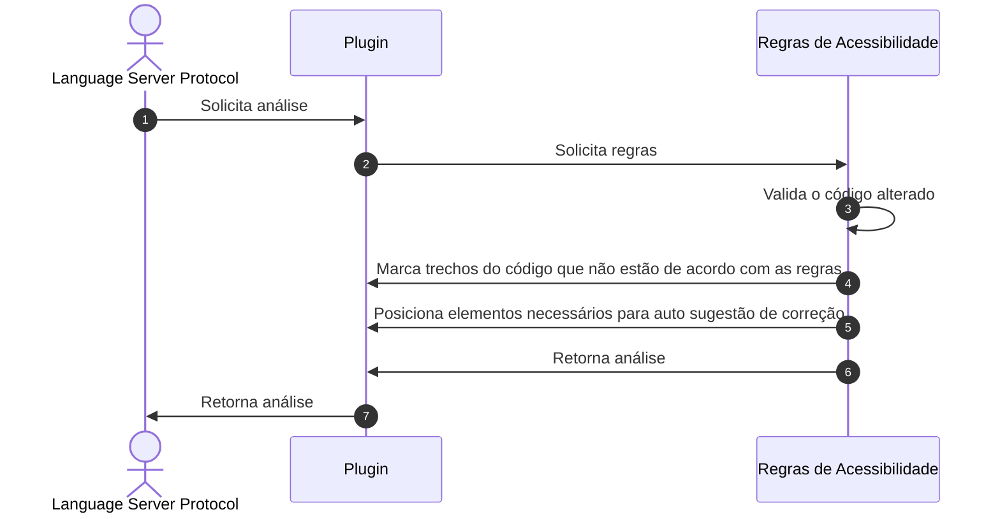
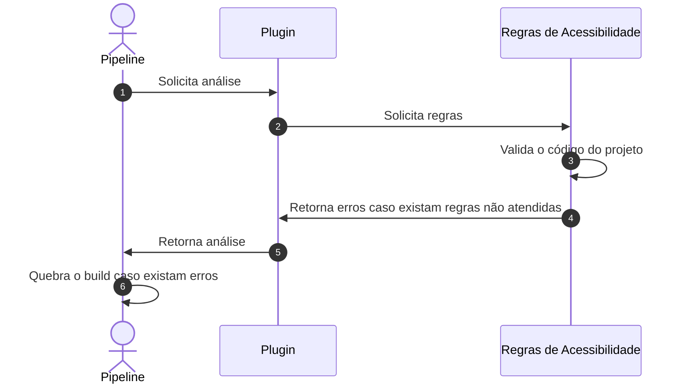
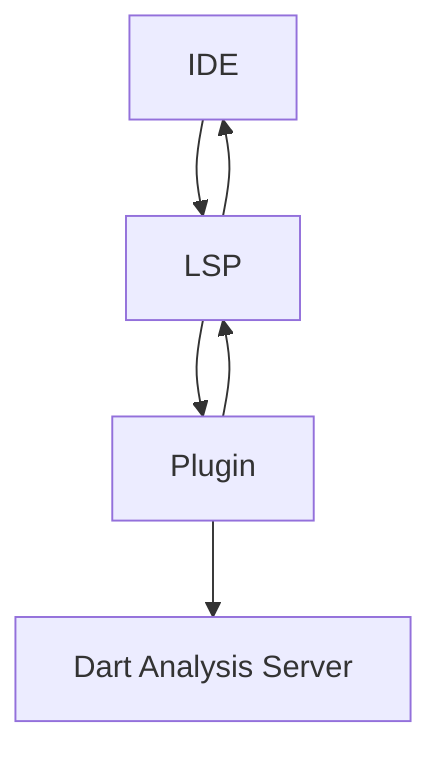
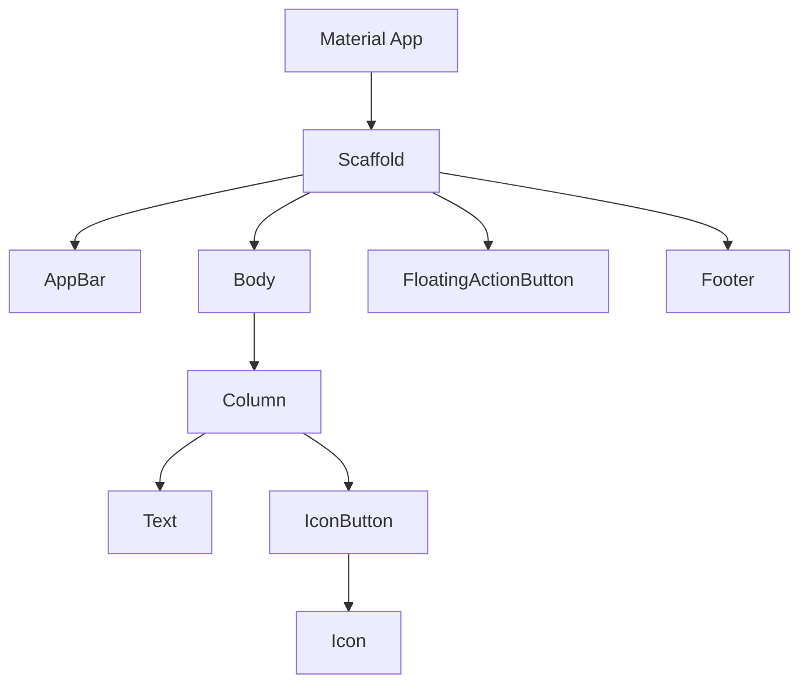

# Diagramas

```mermaid
sequenceDiagram
    autonumber
    actor Desenvolvedor as Desenvolvedor
    participant IDE as IDE
    participant LSP as Language Server Protocol
    participant Plugin as Plugin

    Desenvolvedor ->> IDE: Escreve código
    IDE ->> LSP: Solicita análise
    LSP ->> Plugin: Solicita análise
    Plugin ->> Plugin: Verifica código
    Plugin ->> Plugin: Valida regras de acessibilidade
    Plugin ->> LSP: Retorna análise
    LSP ->> IDE: Retorna análise
    IDE ->> Desenvolvedor: Exibe análise
```

```mermaid
sequenceDiagram
    autonumber
    actor LSP as Language Server Protocol
    participant Plugin as Plugin
    participant Regras as Regras de Acessibilidade

    LSP ->> Plugin: Solicita análise
    Plugin ->> Regras: Solicita regras
    Regras ->> Regras: Valida o código alterado
    Regras ->> Plugin: Marca trechos do código que não estão de acordo com as regras
    Regras ->> Plugin: Posiciona elementos necessários para auto sugestão de correção
    Regras ->> Plugin: Retorna análise
    Plugin ->> LSP: Retorna análise
```

```mermaid
sequenceDiagram
    autonumber
    actor Pipeline as Pipeline
    participant Plugin as Plugin
    participant Regras as Regras de Acessibilidade

    Pipeline ->> Plugin: Solicita análise
    Plugin ->> Regras: Solicita regras
    Regras ->> Regras: Valida o código do projeto
    Regras ->> Plugin: Retorna erros caso existam regras não atendidas
    Plugin ->> Pipeline: Retorna análise
    Pipeline ->> Pipeline: Quebra o build caso existam erros
```

```mermaid
graph TD
    A[IDE] --> B[LSP]
    B --> C[Plugin]
    C --> D[Dart Analysis Server]
    C --> B
    B --> A
```

```mermaid
sequenceDiagram
    autonumber
    actor Desenvolvedor as Desenvolvedor
    participant IDE as IDE
    participant LSP as Language Server Protocol
    participant Plugin as Plugin

    Desenvolvedor ->> IDE: Escreve código
    IDE ->> LSP: Solicita análise
    LSP ->> Plugin: Solicita análise
    Plugin ->> Plugin: Verifica código
    Plugin ->> Plugin: Valida regras de acessibilidade
    Plugin ->> LSP: Retorna análise
    LSP ->> IDE: Retorna análise
    IDE ->> Desenvolvedor: Exibe análise
```

```mermaid
graph TD
    A[Material App] --> B[Scaffold]
    B --> C[AppBar]
    B --> D[Body]
    D --> E[Column]
    E --> F[Text]
    E --> G[IconButton]
    G --> H[Icon]
    B --> I[FloatingActionButton]
    B --> J[Footer]
```